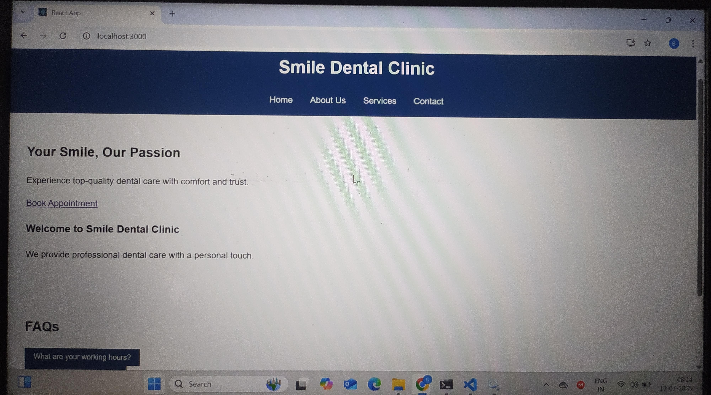

# 🦷 Internshala Dental Clinic Website

This project is a **responsive, accessible, and modern front-end website for a dental clinic**.

It showcases skills in ReactJS, React Router DOM, functional components, hooks, Axios (for form simulation), and clean UI design principles. The website includes structured pages like Home, About, Services, and Contact, and follows best practices in front-end development.

---

## 🌐 Live Demo

👉 **[View Deployed Site on Netlify](https://internshala-dental.netlify.app)**  

---

## 📸 Project Screenshots

| Home Page | Services Page | Contact Page |
|-----------|----------------|----------------|
|  |  |  |

---

## 🚀 Features

- ✅ **Single Page Application** using React Router DOM
- ✅ **Responsive Layout** for desktop, tablet, and mobile
- ✅ **Functional Components** with React Hooks
- ✅ **Reusable Components**: Header, Footer, FAQ
- ✅ **Service List** with expandable modals
- ✅ **Contact Form** with basic validation (Axios simulated)
- ✅ **Google Map Embed** for location
- ✅ **Semantic HTML** and **ARIA roles** for accessibility

---

## 🛠️ Tech Stack

- **ReactJS (Functional Components + Hooks)**
- **React Router DOM** – for client-side routing
- **Axios** – for simulating form submission
- **CSS (custom)** – with responsive design
- **Bootstrap (optional)** – for layout/grid
- **HTML5 + ARIA** – for accessibility

---


---

## 📋 Pages Included

### 1. **Home Page**
- Hero banner
- Introduction
- Service highlights
- Book Appointment CTA

### 2. **About Us**
- Clinic background
- Practitioner info
- Clinic mission and philosophy

### 3. **Services Page**
- Grid of at least 6 services (title, icon/image, short description)
- Option to expand for more details via modal

### 4. **Contact Page**
- Contact form (Name, Email, Subject, Message) with validation
- Axios used to simulate POST request
- Contact info (phone, email, address)
- Google Maps embed via iframe

---

## 🧪 How to Run Locally

```bash
# 1. Clone the repository
git clone https://github.com/your-username/internshala-dental

# 2. Navigate to the folder
cd internshala-dental

# 3. Install dependencies
npm install

# 4. Start the development server
npm start

